# Unnamed Password Manager
### Introduction
This is a password manager. Keep your passwords safe. :> 

### Features:
 - Fully local storage
 - Symmetric AES encryption
 - Multiple users
 - Cross platform
 - Web ui

## Working
Why use Unnamed Password Manager (UNPM)
### Before UNPM
"Never use common password"
    - A wise person

```mermaid
flowchart LR
    vw[Visit Website]
        --> s[Sign up using unique password]
        --> fp["Forgot Password 😭"]
    vw[Visit Website]
        --> sa[Sign up with common password]
        --> gh[Get all your accounts hacked]
```

### After UNPM

## FAQ
#### How to Backup?
 - Check where AppData is standard stored if your OS is not mentioned here.
 - Linux:
 - - Backup the file at the location "~/.local/share/Unnamed_Password_Manager/\<USERNAME\>"
 - - Paste it in the same location or follow the directions for the OS.

# Dev docs
## Rest API
##### WARNING:
    Do NOT use this api for ANY reason EXCEPT if usage is ONLY local, i.e.,
    this api is NOT built for usage over an external network and doing so
    WILL NOT BE SECURE
###### Note: 
    Server throws 405 METHOD NOT ALLOWED if the url is mistyped

